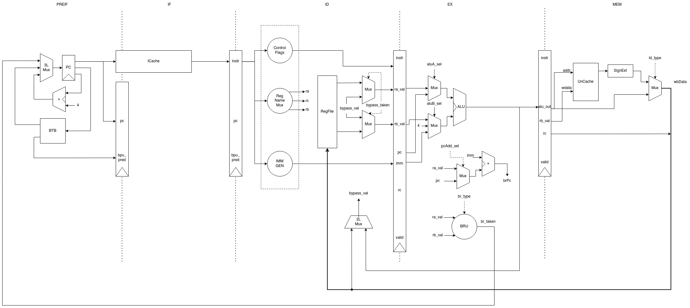

# 凪(Nagi) 顺序单/双发射LA32R处理器

## Intro

凪(**Nagi**，意为“风平浪静”)包含两个支持部分LoongArch32R指令集的处理器：
- 名为**NagiCore**的顺序单发射五级流水线标量处理器
- 名为**NagiDual**的顺序双发射六级流水线超标量处理器

Nagi系列处理器都具有Cache(缓存)、BTB(分支预测)、Store Buffer(写缓存)、多周期乘除法器等部件，并支持AXI4总线访问（包括突发传输），能够正确通过在仿真环境和FPGA上的所有等级测试和性能测试。

Nagi系列处理器是使用Chisel进行开发的，与敏捷开发环境[NagiDev](https://github.com/MrAMS/Nagi)紧密联系，可基于Verilator进行完整仿真，同时也可生成龙芯杯所需的FPGA上板工程。

Nagi系列处理器是为2024年[龙芯杯](http://www.nscscc.com/)个人赛设计的，最终取得了LoongArch赛道第4名，决赛现场第1名的成绩(`0.000s`)。

## 性能指标

NagiCore性能一览

| 测试程序 | 耗时(s) | 频率(MHz) | IPC        | 分支预测准确率 | ICache命中率 |
| ----------- | ------- | --------- | ---------- | -------------- | ------------ |
| MATRIX      | 0.117   | 198       | 0.40116772 | 0.994812547    | 0.999997993  |
| CRYPTONIGHT | 0.214   | 198       | 0.5569556  | 0.999994914    | 0.99999922   |

NagiDual性能一览

| 测试程序 | 耗时(s) | 频率(MHz) | IPC        | 分支预测准确率 | ICache命中率 |
| ----------- | ------- | --------- | ---------- | -------------- | ------------ |
| MATRIX      | 0.132   | 162       | 0.43596125 | 0.994812547    | 0.999997562  |
| CRYPTONIGHT | 0.230   | 162       | 0.63767296  | 0.999994914    | 0.999999003   |

*注：IPC等指标是从计时器开始时记录的（即串口输出`0x06`后开始）*

*注：仍有相当大的超频空间*

## CPU架构

Nagi系列处理器的流水线采用各模块解耦的分布式控制。由于个人赛的性能测试程序(CRYPTONIGHT)对DCache极不友好，而且在高频率下访存代价非常大(采用多周期访存，SRAM最高工作频率仅约50MHz)，故均去除了DCache。

NagiCore处理器采用五级流水线，包括预取指(PREIF)、取指(IF)、译码(ID)、执行(EX)、访存(MEM)五个阶段。

NagiDual 处理器采用六级流水线，包括预取指(PREIF)、取指(IF)、译码(ID)、发射(IS)、执行(EX)、访存(MEM) 六个阶段。采用简单的非对称双发射结构以追求频率。

更详尽的设计介绍请参见大赛设计报告`design.pdf`。

